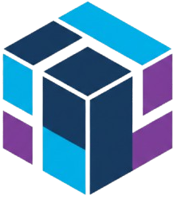

<div align="center">



# mosaic

A package manager for [Polytoria](https://polytoria.com).

[](LICENSE)
[](https://www.rust-lang.org/)
[](https://github.com/doshibadev/mosaic/releases)

</div>

---

## What is Mosaic?

Stop copy-pasting Lua scripts between projects. Mosaic lets you **install, manage, and share Lua packages** for Polytoria just like [Cargo](https://crates.io) or [npm](https://www.npmjs.com), but actually built for Polytoria's XML-based project format.

Instead of manually dragging ModuleScripts around or hunting through the Polytoria asset store for half-finished models, you get:
- **Version management**: Pin specific versions, get updates when you want them
- **Dependency resolution**: Install a package, it installs what it needs
- **Easy sharing**: Publish your own packages for the community
- **One command**: `mosaic install logger@1.0.0` instead of hunting through assets

It's like npm, but for Polytoria developers who are tired of the manual grind.

## Quick start

**Install the CLI:**

```bash
# macOS / Linux
curl -fsSL https://getmosaic.run/install.sh | sh

# Windows (PowerShell)
irm https://getmosaic.run/install.ps1 | iex
```

Or grab the latest release from [GitHub Releases](https://github.com/doshibadev/mosaic/releases).

**Use it:**

```bash
# Create a new project
mosaic init

# Log in to the registry
mosaic login

# Install a package
mosaic install logger@1.0.0

# Publish your own
mosaic publish
```

Mosaic injects packages as ModuleScripts into your `.poly` file. Use them like this:

```lua
local Logger = require(game["ScriptService"]["logger"])
Logger:info("hey, it works")
```

## Commands

| Command              | What it does                           |
| -------------------- | -------------------------------------- |
| `mosaic init`        | Create a `mosaic.toml` in your project |
| `mosaic login`       | Authenticate with the registry         |
| `mosaic install`     | Install a package (`name@version`)     |
| `mosaic search`      | Search the registry                    |
| `mosaic list`        | Show installed packages                |
| `mosaic publish`     | Upload your package to the registry    |
| `mosaic remove`      | Uninstall a package                    |

## How it works

```
  You                    Mosaic CLI                Registry                  Storage
   │                        │                        │                         │
   ├── mosaic install ──────►                        │                         │
   │                        ├── resolve version ────►│                         │
   │                        │◄── metadata ───────────┤                         │
   │                        ├── download blob ───────┼────────────────────────►│
   │                        │◄── lua source ─────────┼─────────────────────────┤
   │                        ├── inject into .poly    │                         │
   │◄── done ───────────────┤                        │                         │
```

1. CLI resolves the package version against the registry API
2. Downloads the Lua source from Cloudflare R2 (verified with SHA256)
3. Injects it as a ModuleScript into your Polytoria project file
4. Updates `mosaic.toml` with the new dependency

## Project layout

```
mosaic/
├── cli/          # Rust CLI (clap, reqwest, quick-xml)
├── registry/     # Axum API server (PostgreSQL + R2)
├── website/      # Next.js website & package browser
├── research/     # Experiments and test data
└── assets/       # Logo and brand stuff
```

## Building from source

```bash
git clone https://github.com/doshibadev/mosaic.git
cd mosaic

# Build the CLI
cd cli
cargo build --release

# Run the registry (needs Neon PostgreSQL + R2 credentials)
cd ../registry
cargo run
```

## Stack

- **CLI**: Rust (clap, reqwest, quick-xml)
- **Registry**: Rust (Axum, Neon PostgreSQL, Cloudflare R2)
- **Website**: Next.js, Tailwind CSS
- **Auth**: JWT

## Status

Mosaic is **early but functional**. The core loop works: you can init, install, publish, and remove packages. There's still rough edges and missing features, but it's usable if you're building on Polytoria and want something better than copy-pasting scripts.

## Contributing

Want to help? We'd love that. Here's how:

1. **Found a bug?** [Open an issue](https://github.com/doshibadev/mosaic/issues) with details
2. **Have an idea?** [Start a discussion](https://github.com/doshibadev/mosaic/discussions)
3. **Want to code?** Fork the repo, make your changes, and submit a PR. Make sure to:
   - Test your changes locally
   - Keep commits clean and descriptive
   - Follow the existing code style
4. **Just starting?** Look for issues labeled `good first issue` — those are beginner-friendly

The codebase is organized by component (CLI, registry, website), so pick what interests you. Questions? Just ask in an issue.

## License

MIT — see [LICENSE](LICENSE).

---

<div align="center">
<sub>made for the polytoria community</sub>
</div>
