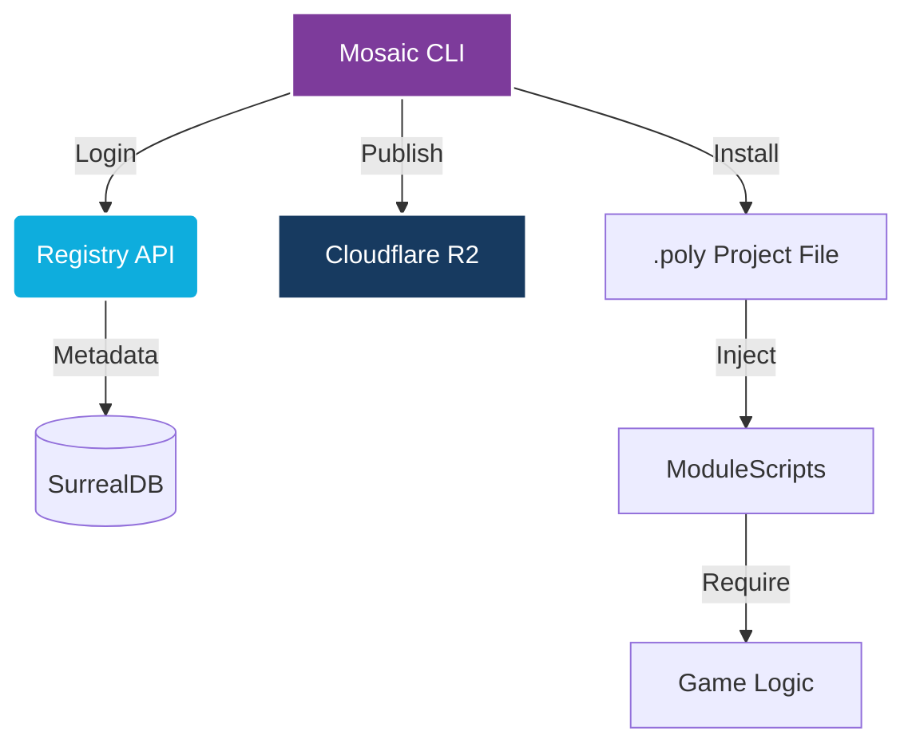

# Mosaic

<div align="center">


**The official package manager for Polytoria game development.**

[](https://opensource.org/licenses/MIT)
[](https://www.rust-lang.org/)
[](https://github.com/yourusername/mosaic)

[Quick Start](#quick-start) • [Features](#features) • [CLI Reference](#cli-reference) • [Registry](#registry)

</div>

---

Mosaic is a content-addressable package manager for Polytoria. It orchestrates Lua modules directly into `.poly` project files, providing a seamless, versioned development experience.

---

## ⚡ Quick Start

```bash
# Login to the Registry
mosaic login

# Initialize your project
mosaic init

# Install a package from the Registry
mosaic install logger@1.0.0

# Publish your own package
mosaic publish
```

In Polytoria Creator, your modules are automatically injected into `ScriptService`:

```lua
local Logger = require(game["ScriptService"]["logger"])
Logger:info("Mosaic is online!")
```

---

## ✨ Features

- **🚀 Native Registry** — High-performance package discovery powered by SurrealDB.
- **📦 Content-Addressable Storage** — Secure blob storage on Cloudflare R2 with SHA256 verification.
- **🎨 Premium CLI** — Polished TrueColor aesthetics, rich tables, and clear progress indicators.
- **🛠️ Zero-Friction** — No build steps. Injects ModuleScripts directly into Polytoria XML.
- **🔐 Secure Auth** — JWT-based authentication for publishers.
- **🧹 Single Source of Truth** — Registry-centric model for maximum reliability.

---

## 🛠️ How It Works

Mosaic bridges the gap between the Lua ecosystem and Polytoria's XML-based project format using a modern, distributed architecture.



1. **Mosaic CLI** — Your entry point for all package management tasks.
2. **Registry API** — Handles authentication, package registration, and discovery.
3. **SurrealDB** — Stores package metadata, owners, and version history.
4. **Cloudflare R2** — Securely hosts packaged Lua blobs.

---

## 🖥️ CLI Reference

| Command          | Description                                      |
| ---------------- | ------------------------------------------------ |
| `mosaic init`    | Create a `mosaic.toml` in the current directory. |
| `mosaic login`   | Authenticate with the Mosaic Registry.           |
| `mosaic install` | Download and inject a package (`name@version`).  |
| `mosaic search`  | Find packages in the Registry.                   |
| `mosaic list`    | View installed dependencies.                     |
| `mosaic publish` | Package and upload your project to the Registry. |
| `mosaic remove`  | Cleanly uninstall a package from project & XML.  |

---

## 🧱 Project Structure

```text
mosaic/
├── cli/            # Rust-based CLI source code
├── registry/       # Axum API + SurrealDB backend
├── research/       # Experimental scripts and test data
└── assets/         # Brand assets and logos
```

---

## 🏗️ Development Setup

```bash
# Clone the repository
git clone https://github.com/yourusername/mosaic.git
cd mosaic

# Build the CLI
cd cli
cargo build --release

# Run the API (Requires SurrealDB & Cloudflare R2 credentials)
cd ../registry
cargo run
```

---

## 🛤️ Roadmap

- [x] **Phase 1**: CLI core (XML Injection & Dependencies)
- [x] **Phase 2**: Registry API MVP (JWT, SurrealDB, R2)
- [x] **Phase 3**: CLI & Registry Integration
- [x] **Phase 5**: Premium UX & brand-consistent Polish
- [ ] **Phase 4**: Website discovery UI & Landing Page (Coming Soon)

---

**Made with ❤️ for the Polytoria community**
