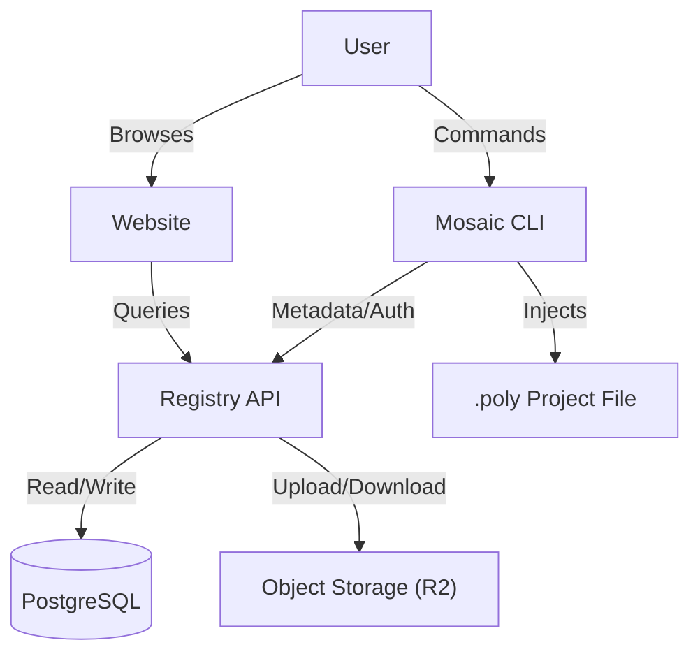

# Architecture

Mosaic is designed to be a decentralized-friendly, secure, and efficient package manager for the Polytoria ecosystem. It consists of three main components: the CLI, the Registry, and the Website.

## The CLI (`/cli`)

The CLI is written in **Rust** and acts as the bridge between the user's local project and the registry.

### Dependency Resolution
Mosaic uses a recursive dependency resolution strategy:
1. When you install `A`, it fetches `A`'s metadata.
2. It sees `A` depends on `B`.
3. It recursively resolves `B`.
4. It detects circular dependencies (e.g., `A -> B -> A`) and errors out to prevent infinite loops.
5. It uses a `mosaic.lock` file (conceptually) to lock versions and ensure reproducible builds (implementation details in `lockfile.rs`).

### XML Injection
Polytoria projects are stored as `.poly` files, which are XML-based. Mosaic parses this XML to inject scripts directly.

- **Injection Point:** It looks for `ScriptService` within the project.
- **Format:** Packages are injected as `ModuleScript` items.
- **Properties:**
  - `Name`: The package name.
  - `Source`: The Lua source code.
- **Updates:** If a package already exists, Mosaic intelligently updates the `Source` property while preserving the structure.

## The Registry (`/registry`)

The backend is a **Rust (Axum)** application designed for performance and reliability.

- **Database:** Neon (Serverless PostgreSQL). Stores user data, package metadata, and version history.
- **Storage:** Cloudflare R2 (S3-compatible). Stores the actual package source code as immutable blobs (zip files).
- **Search:** Leverages PostgreSQL's full-text search (`to_tsvector`, `websearch_to_tsquery`) for efficient package discovery.

## Security

- **Authentication:** JWT (JSON Web Tokens) are used for stateless authentication.
- **Integrity:**
  - Package blobs are hashed (SHA256) upon upload.
  - The CLI verifies this hash against the lockfile during installation to prevent supply-chain attacks.
- **Ownership:** Only the original author of a package can publish new versions.
